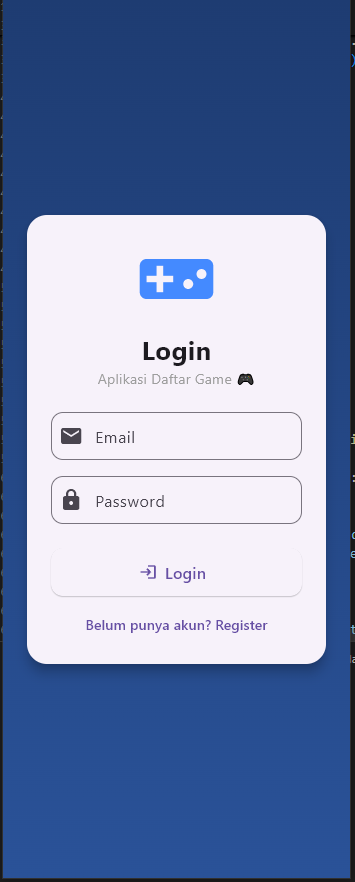
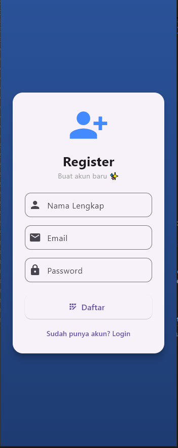
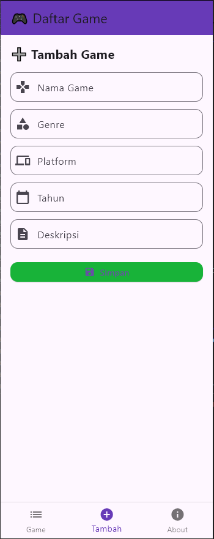
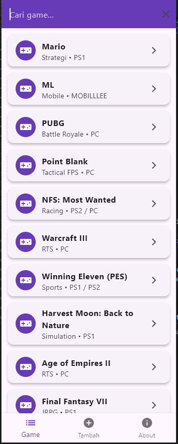
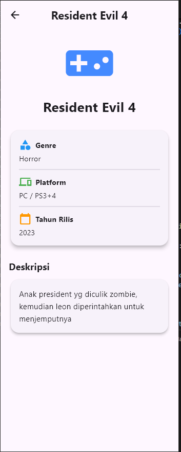
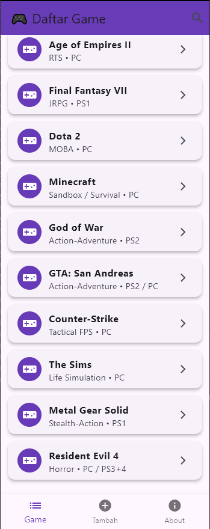
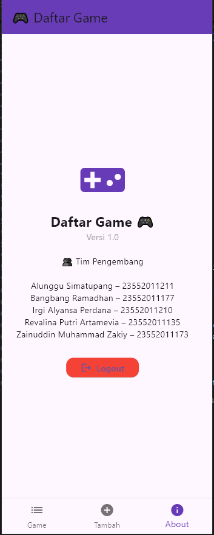

# 🎮 Daftar Game App

Aplikasi **Daftar Game** merupakan aplikasi mobile berbasis **Flutter** yang digunakan untuk menampilkan, menambah, mencari, dan melihat detail informasi game.  
Aplikasi ini terhubung dengan **REST API (PHP + MySQL)** dan memiliki fitur **Login & Register**.

---

## 🖼️ Tampilan Aplikasi

### 🎥 Video Demo
**0. Video Layar (Landscape)**  
<video src="0-VideoDemo.mkv" controls width="600"></video>

---

### 📸 Screenshot Aplikasi

## 📸 Screenshot Aplikasi

### 🧩 Tampilan Aplikasi

**1️⃣ Home | 2️⃣ Register | 3️⃣ Input Data | 4️⃣ List & Searching**

  
  
  
  

**5️⃣ Detail Informasi | 6️⃣ Navigasi | 7️⃣ About**

  
  
  

---

## 📘 Deskripsi Tugas

Project ini dibuat untuk memenuhi **Tugas UAS Pemrograman Mobile 2**.

**Mata Kuliah** : Pemrograman Mobile 2  
**Dosen Pengampu** : **Nova Agustina, ST., M.Kom.**  
**Universitas** : **Universitas Teknologi Bandung**

---

## ✨ Fitur Aplikasi

- Login & Register User
- Validasi login (user/password tidak terdaftar)
- Menampilkan daftar game
- Pencarian game (search)
- Tambah data game
- Detail informasi game
- Bottom Navigation
- Logout
- UI/UX sederhana & modern

---

## 👥 Tim Pengembang

Alunggu Simatupang – 23552011211  
Bangbang Ramadhan – 23552011177  
Irgi Alyansa Perdana – 23552011210  
Revalina Putri Artamevia – 23552011135  
Zainuddin Muhammad Zakiy – 23552011173  

---

## 📌 Catatan

Project ini dibuat untuk **keperluan akademik (UAS)** dan sebagai sarana pembelajaran pengembangan aplikasi mobile menggunakan **Flutter** dan **REST API**.
